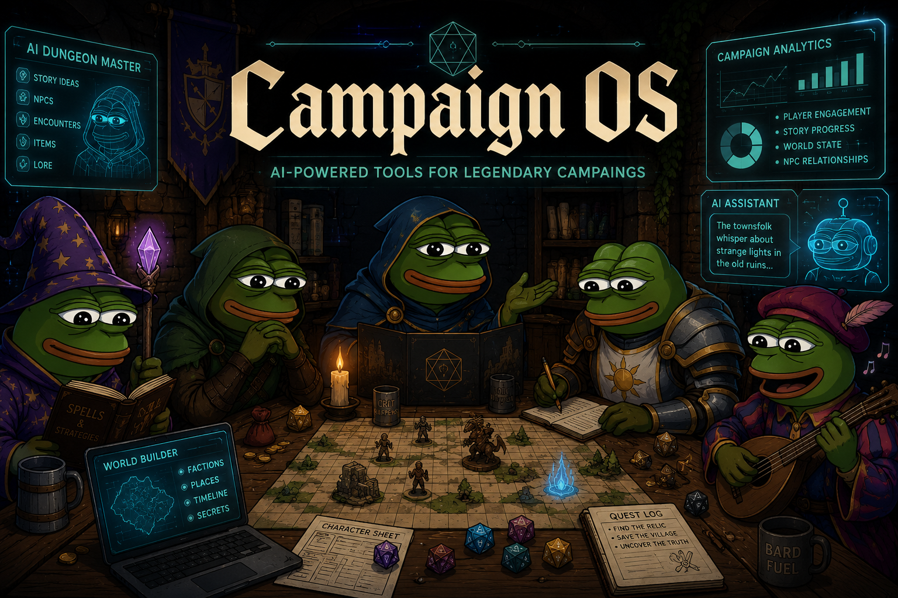

# Campaign OS

Campaign OS is a Markdown-first home for a tabletop RPG campaign.

It gives a GM and an AI collaborator a shared way to keep track of what actually happened, what is still uncertain, and what is only being prepared for the next session. The aim is not to turn your game into a database or let an assistant write your canon for you. It is to make long-running campaigns easier to run without losing their history, loose ends, or human voice.

The included example campaign, **Echoes of Tal Dorei**, uses Dungeons & Dragons 5.5, but the system is deliberately game-agnostic. Swap in a different campaign and a different `RULES/<system-id>/` folder, and the same operating model still applies.

## The short version

Campaign OS keeps five things separate:

- **Source** — raw notes, transcripts, images, PDFs, recordings, and other session evidence.
- **Session** — an account of what was observed at the table.
- **Working** — prep, theories, investigations, continuity notes, and draft ideas.
- **Canon** — approved world history, entities, and relationships.
- **State** — useful, replaceable snapshots of where the world and party stand now.

That distinction is the heart of the project. A clever idea for next week is not a fact about the world. A summary is not the same thing as evidence. And when two records disagree, the disagreement should be visible and traceable rather than quietly edited away.

## Why this exists

Long campaigns accumulate a particular kind of mess: half-remembered NPC promises, mysteries that stalled three months ago, notes that contradict each other, and great prep that accidentally gets remembered as something that already happened.

Campaign OS is built to help with that mess while keeping the GM in charge. It is useful if you want to:

- preserve the original material from a session instead of relying on memory;
- turn play into structured, reviewable campaign history;
- prepare future sessions without locking yourself into a script;
- track NPCs, factions, places, relationships, clues, and open questions;
- ask an AI for help without letting it silently invent or rewrite canon;
- keep the campaign portable as plain files, rather than tying it to one tool or model.

## How campaign knowledge moves

The project uses a simple truth pipeline:

```text
Source Record
  → Session observation
  → Working record (when interpretation is needed)
  → Proposed event
  → Human approval
  → Canon updates
  → Derived state refresh
  → Processing report
```

Only approved events establish world-history truth. AI-generated summaries, prep packets, simulations, and state views can be helpful, but none of them outrank the source material or approved canon.

## What is in the repository

```text
SYSTEM/           How Campaign OS itself operates: runtime rules, invariants, and skills
SPECIFICATIONS/   Contracts for records such as campaigns, sessions, events, and entities
TEMPLATES/        Starting points for valid records
COMMANDS/          Human-facing entry points for common work
WORKFLOWS/         The multi-step processes behind those commands
TASKS/             Small, focused procedures used by workflows
CAMPAIGNS/         Your actual campaign material
TESTS/             Safe fixtures and dry runs for testing skills and processes
```

Each campaign lives in `CAMPAIGNS/<campaign-id>/` and normally contains:

| Folder | What belongs there |
| --- | --- |
| `SOURCE/` | The original material: notes, transcripts, screenshots, audio, PDFs, and so on. |
| `CANON/` | Approved sessions, events, entities, and relationships. |
| `STATE/` | Rebuildable views such as the current world, party, timeline, and known mysteries. |
| `WORKING/` | Non-canonical prep, theories, investigations, and draft session plans. |
| `REFERENCE/` | Setting lore and primers used to ground play. |
| `RULES/<system-id>/` | Game-specific planning guidance; this is separate from Campaign OS itself. |
| `REPORTS/` | Processing reports and change-set summaries. |
| `ASSETS/` | Maps, handouts, images, and other supporting media. |

You do not need to create every possible subfolder on day one. Start with the stable buckets, then add narrower folders when real material calls for them.

## The main ways to use it

### Process a played session

Bring your notes, transcript, screenshots, or recording after the game. The [Process Session command](COMMANDS/PROCESS_SESSION.md) preserves the input, records the session at the observation layer, opens working notes where the evidence is unclear, and prepares a reviewable change set.

It can draft events and suggest entity or relationship updates, but it pauses before anything canon-affecting is applied. You review and approve that boundary.

Example prompt:

> Process these Session 12 notes for `my-campaign`. Keep the contradictory account of the ritual in working state, draft only well-supported events, and show me the pending canon changes for approval.

### Prepare the next session

Use [Plan Session](COMMANDS/PLAN_SESSION.md) when you have a rough idea, an existing plan to revise, or simply need a table-ready packet. It looks at the relevant current state, open threads, and campaign constraints, then keeps its output in `WORKING/`.

Example prompt:

> I want a tense but grounded Session 13 in the market district. Build a flexible prep packet around the missing archivist, give each player a chance to matter, and avoid resolving the larger conspiracy.

### Add an NPC without forcing them into canon

[Suggest NPC](COMMANDS/SUGGEST_NPC.md) creates grounded options from the location, factions, current pressure, and tone. An NPC suggestion is just a suggestion until they appear in play and later pass through the normal truth pipeline.

Example prompt:

> Suggest three recurring NPCs for a dockside investigation. I need one ally, one complication, and one person whose motives are hard to read. Keep them distinct from the people already in canon.

## Skills

Skills are optional, task-focused assistants that sit on top of the repository's Markdown rules. They help an AI load the right amount of context and produce a consistent kind of result; they do not replace the truth pipeline or grant permission to change canon.

The repository currently includes ten skills:

| Skill | Best for | What it gives you |
| --- | --- | --- |
| [`process-session`](SYSTEM/SKILLS/process-session/SKILL.md) | Turning real session material into a safe processing packet | Source preservation, session observations, draft events, a pending change set, and a report. |
| [`session-prep`](SYSTEM/SKILLS/session-prep/SKILL.md) | Drafting, revising, or pressure-testing future sessions | Grounded prep packets, hooks, spotlight beats, continuity guardrails, and short campaign digests. |
| [`campaign-qa`](SYSTEM/SKILLS/campaign-qa/SKILL.md) | Checking continuity and narrative pressure | Contradictions, repeated clues, knowledge leaks, dangling threads, and prep risks. |
| [`campaign-health`](SYSTEM/SKILLS/campaign-health/SKILL.md) | Taking the campaign's pulse between sessions or arcs | Strengths, stress points, mystery load, recurring-cast depth, and prep readiness. |
| [`mystery-manager`](SYSTEM/SKILLS/mystery-manager/SKILL.md) | Running investigation-heavy play | A clear separation of clues, false leads, hidden truth, theories, and unresolved questions. |
| [`consequence-engine`](SYSTEM/SKILLS/consequence-engine/SKILL.md) | Tracking delayed fallout | Possible consequences, affected actors, trigger windows, and choices about what should surface next. |
| [`entity-extractor`](SYSTEM/SKILLS/entity-extractor/SKILL.md) | Reading material for NPC, faction, location, object, or relationship candidates | Structured proposals, duplicate checks, evidence hooks, and recommendations about whether to persist them. |
| [`knowledge-matrix`](SYSTEM/SKILLS/knowledge-matrix/SKILL.md) | Working out who knows what | A source-aware map of knowledge, confidence, secrets, and knowledge boundaries. |
| [`npc-simulator`](SYSTEM/SKILLS/npc-simulator/SKILL.md) | Rehearsing a scene with an established NPC | Plausible reactions, priorities, likely withholdings, and clear limits on speculation. |
| [`lore-search`](SYSTEM/SKILLS/lore-search/SKILL.md) | Answering a lore question from the campaign files | A grounded answer with file citations and clear labels for canon, state, prep, and evidence. |

### A few useful skill prompts

> Run a knowledge matrix for what the party, the city watch, and Mara know about the broken seal. Flag anything that is only inferred rather than established.

> Give me a consequence register after last night's bargain with the cult. Separate confirmed fallout from optional future pressure, and do not make any of it canon.

> Do a prep-risk scan on this session plan. I mainly want to know whether an NPC knows too much or whether the plan is trying to resolve too many mysteries at once.

> Rehearse how Captain Olan might respond if the party produces the forged ledger. Stay within his established knowledge and tell me where the simulation becomes speculative.

## Starting a new campaign

1. Create `CAMPAIGNS/<your-campaign-id>/`.
2. Add a `CAMPAIGN.md` using [the campaign template](TEMPLATES/CAMPAIGN.template.md).
3. Add only the campaign folders you need, beginning with `SOURCE/`, `CANON/`, `STATE/`, and `WORKING/`.
4. Put setting material in `REFERENCE/` and system-specific material in `RULES/<system-id>/`.
5. After your first game, use the Process Session flow rather than writing the outcome directly into a summary.
6. Before the next game, use a working session plan so your prep stays flexible and clearly non-canonical.

For example, a Blades in the Dark game might use `RULES/blades-in-the-dark/`, while a Call of Cthulhu campaign could use `RULES/call-of-cthulhu/`. The campaign OS stays the same; only the game-facing guidance changes.

## Working with an AI

Start with [AGENTS.md](AGENTS.md). It is the practical routing guide for human and AI collaborators: what to read first, how to select the correct flow, where information belongs, and when a human decision is required.

The non-negotiables are straightforward:

- the AI is an operator, not the source of truth;
- raw evidence is preserved rather than polished into certainty;
- prep, theory, simulation, and summaries stay distinct from canon;
- canonical changes require human approval unless that authority has been explicitly delegated;
- every meaningful canon claim should lead back to evidence or an explicit human decision.

The fuller operating contract lives in [AI Runtime](SYSTEM/AI_RUNTIME.md), and the rules that must always remain true are in [Invariants](SYSTEM/INVARIANTS.md).

## Safe experimentation

Use `TESTS/skills/<skill-name>/` to rehearse a workflow against fake notes, simulated play, or a narrow slice of campaign material. Fixtures go in `fixtures/`; results go in `runs/`.

Tests can be imaginative. They just should not quietly write their inventions into `CANON/` or `STATE/`. See the [skill test guide](TESTS/skills/README.md) for the review ladder used in this repository.

## A note on portability

Campaign OS is intentionally plain. Its source of truth is readable Markdown plus directly referenced assets—not an index, a generated dashboard, or a particular AI vendor. That means you can move the folder, change tools, or come back after a long break and still understand your campaign.

If you only remember one thing, make it this: keep what happened, what might happen, and what you are merely wondering about in different places. Everything else becomes much easier to manage from there.
